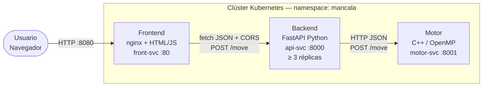

# 01 — Arquitectura del Sistema

## Visión General

El sistema es un motor de juego para **Mancala Kalah(6,4)** compuesto por **cuatro componentes** en contenedores independientes, orquestados con Kubernetes. El motor implementa dos algoritmos: **Minimax con poda Alfa-Beta** y **MCTS con política UCT**, ambos paralelizados con OpenMP.

## Diagrama de Orquestación



## Descripción de Contenedores

### Motor (`motor/`) — Contenedor 1

Proceso C++17 compilado con `-O3 -fopenmp`. Implementa Alpha-Beta y MCTS sobre la misma representación del tablero. Expone un servidor HTTP mínimo en el puerto 8001. **Separado del backend a nivel de contenedor** — no se usa pybind11 ni ctypes; la comunicación es por red interna del clúster.

### Backend (`backend/`) — Contenedor 2

Wrapper Python con **FastAPI**. Valida peticiones con Pydantic, delega al motor vía `httpx`, expone `/healthz`, `/readyz` y `/metrics` Prometheus.

### Frontend (`frontend/`) — Contenedor 3

Servidor estático **nginx** que sirve la SPA HTML/CSS/JS. El cliente realiza `fetch` al backend.

## API REST — Contrato

Toda petición y respuesta usa `Content-Type: application/json; charset=utf-8`.

### `POST /move`

**Request:**
```json
{
  "board":       [4,4,4,4,4,4,0,4,4,4,4,4,4,0],
  "side":        0,
  "algo":        "alphabeta",
  "depth":       8,
  "simulations": null,
  "threads":     4
}
```

**Response (Alpha-Beta):**
```json
{
  "move": 3, "evaluation": 7, "elapsed_ms": 124, "threads_used": 4,
  "stats": { "algo": "alphabeta", "nodes": 1845210, "prunes": 312088 }
}
```

**Response (MCTS):**
```json
{
  "move": 3, "evaluation": 0.62, "elapsed_ms": 118, "threads_used": 4,
  "stats": { "algo": "mcts", "rollouts": 100000, "tree_depth_avg": 14.3, "win_rate": 0.62 }
}
```

### Endpoints adicionales

| Endpoint | Método | Descripción |
|----------|--------|-------------|
| `/healthz` | GET | Liveness probe — `200 {"status":"ok"}` |
| `/readyz` | GET | Readiness probe — `200` solo si motor accesible |
| `/metrics` | GET | Métricas Prometheus |

### Serialización del tablero

Arreglo de **14 enteros** en orden canónico:

| Índice | Descripción |
|--------|-------------|
| 0–5 | Hoyos del Jugador 0 (izquierda → derecha) |
| 6 | Kalaha del Jugador 0 |
| 7–12 | Hoyos del Jugador 1 (izquierda → derecha) |
| 13 | Kalaha del Jugador 1 |

### Códigos HTTP

| Código | Significado |
|--------|-------------|
| 200 | Éxito |
| 422 | Error de validación del schema (Pydantic) |
| 503 | Motor no disponible |
| 504 | Motor no respondió (timeout) |

## Política CORS

```python
app.add_middleware(
    CORSMiddleware,
    allow_origins=["http://localhost:8080", "https://mancala.TU_DOMINIO"],
    allow_methods=["GET", "POST", "OPTIONS"],
    allow_headers=["Content-Type"],
)
```

**No se usa el comodín `*`**. Los orígenes son explícitos: en local apunta a `localhost:8080` (nginx); en nube al dominio real del frontend. El método `OPTIONS` maneja el preflight CORS que el navegador envía antes de cualquier `POST` con `Content-Type: application/json`.
