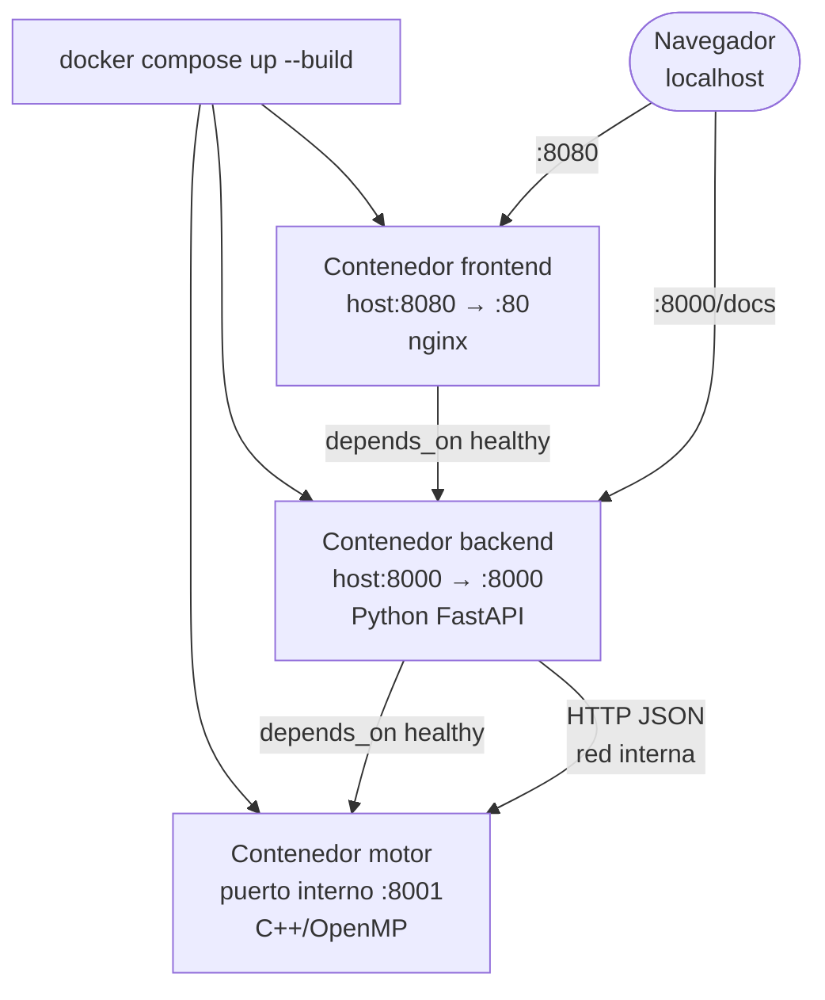
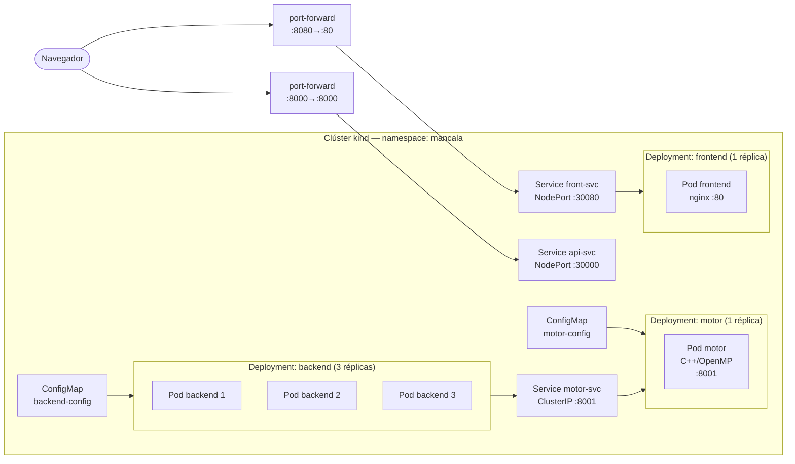

# 04 — Despliegue Local

Este documento explica paso a paso cómo levantar la aplicación completa en tu máquina, tanto con **Docker Compose** (más sencillo) como con **Kubernetes local** (más cercano a producción).

---

## Prerequisitos

### Para Docker Compose

| Herramienta | Versión mínima | Instalación |
|-------------|---------------|-------------|
| Docker Engine | 24.x | https://docs.docker.com/engine/install/ |
| Docker Compose | 2.x | incluido en Docker Desktop o `apt install docker-compose-plugin` |

Verificar:
```bash
docker --version          # Docker version 24.x
docker compose version    # Docker Compose version v2.x
```

### Para Kubernetes local

| Herramienta | Versión mínima | Instalación |
|-------------|---------------|-------------|
| Docker Engine | 24.x | requerido por kind |
| kind | 0.22+ | `go install sigs.k8s.io/kind@latest` o descarga binario |
| kubectl | 1.29+ | https://kubernetes.io/docs/tasks/tools/ |

Verificar:
```bash
kind version       # kind v0.22.x
kubectl version --client
```

---

## Opción 1 — Docker Compose (recomendado para desarrollo)

### Pasos

```bash
# 1. Clonar el repositorio
git clone https://github.com/TU_ORG/TU_REPO.git
cd mancala

# 2. Construir y levantar los 3 contenedores (motor + backend + frontend)
docker compose -f deploy/local/docker-compose.yml up --build

# La primera vez tarda ~5 min (compila C++ con CMake).
# Verás en la terminal:
#   mancala-motor    | Motor HTTP server listening on port 8001
#   mancala-backend  | Uvicorn running on http://0.0.0.0:8000
#   mancala-frontend | /docker-entrypoint.sh: Configuration complete
```

### Acceso

| Servicio | URL |
|---------|-----|
| Interfaz del juego | http://localhost:8080 |
| API REST (Swagger) | http://localhost:8000/docs |
| Healthcheck backend | http://localhost:8000/healthz |
| Readiness (motor OK) | http://localhost:8000/readyz |
| Métricas Prometheus | http://localhost:8000/metrics |

### Probar un movimiento desde terminal

```bash
curl -s -X POST http://localhost:8000/move \
  -H "Content-Type: application/json" \
  -d '{
    "board": [4,4,4,4,4,4,0,4,4,4,4,4,4,0],
    "side": 0,
    "algo": "alphabeta",
    "depth": 8,
    "threads": 4
  }' | python3 -m json.tool
```

Respuesta esperada:
```json
{
  "move": 5,
  "evaluation": 1,
  "elapsed_ms": 4,
  "threads_used": 4,
  "stats": {
    "algo": "alphabeta",
    "nodes": 18738,
    "prunes": 4980
  }
}
```

### Detener

```bash
# Ctrl+C en la terminal donde corre, o en otra terminal:
docker compose -f deploy/local/docker-compose.yml down
```

### Ver logs de un servicio específico

```bash
docker compose -f deploy/local/docker-compose.yml logs motor
docker compose -f deploy/local/docker-compose.yml logs backend
docker compose -f deploy/local/docker-compose.yml logs frontend
```

### Diagrama de contenedores Docker Compose



---

## Opción 2 — Kubernetes local con kind

### Paso 1 — Instalar kind y kubectl

```bash
# kind (en Linux x86_64)
curl -Lo ./kind https://kind.sigs.k8s.io/dl/v0.22.0/kind-linux-amd64
chmod +x ./kind && sudo mv ./kind /usr/local/bin/kind

# kubectl
curl -LO "https://dl.k8s.io/release/$(curl -L -s https://dl.k8s.io/release/stable.txt)/bin/linux/amd64/kubectl"
chmod +x kubectl && sudo mv kubectl /usr/local/bin/kubectl
```

### Paso 2 — Construir imágenes Docker locales

kind no tiene acceso a GHCR si no has hecho push. Construye las imágenes localmente y cárgalas al clúster:

```bash
# Construir las 3 imágenes
docker build -t mancala-motor:local   ./motor
docker build -t mancala-backend:local ./backend
docker build -t mancala-frontend:local ./frontend
```

### Paso 3 — Crear el clúster kind

```bash
kind create cluster --name mancala
# Salida esperada:
#   Creating cluster "mancala" ...
#   Set kubectl context to "kind-mancala"
#   Have a question, bug, or feature request? ...

# Verificar
kubectl cluster-info --context kind-mancala
```

### Paso 4 — Cargar imágenes al clúster

```bash
kind load docker-image mancala-motor:local   --name mancala
kind load docker-image mancala-backend:local --name mancala
kind load docker-image mancala-frontend:local --name mancala
```

### Paso 5 — Actualizar manifiestos para usar imágenes locales

Los manifiestos en `deploy/local/k8s/` apuntan a `ghcr.io/YOUR_ORG/...`. Para kind, edita temporalmente los Deployments o aplica un patch:

```bash
# Reemplazar imagen en motor.yaml
sed -i 's|ghcr.io/YOUR_ORG/mancala-motor:.*|mancala-motor:local|g' \
    deploy/local/k8s/motor.yaml

# Reemplazar imagen en backend.yaml
sed -i 's|ghcr.io/YOUR_ORG/mancala-backend:.*|mancala-backend:local|g' \
    deploy/local/k8s/backend.yaml

# Reemplazar imagen en frontend.yaml
sed -i 's|ghcr.io/YOUR_ORG/mancala-frontend:.*|mancala-frontend:local|g' \
    deploy/local/k8s/frontend.yaml

# Cambiar imagePullPolicy a Never (no intentar descargar)
sed -i 's|imagePullPolicy: Always|imagePullPolicy: Never|g' \
    deploy/local/k8s/motor.yaml deploy/local/k8s/backend.yaml deploy/local/k8s/frontend.yaml
```

### Paso 6 — Aplicar manifiestos

```bash
kubectl apply -f deploy/local/k8s/namespace.yaml
kubectl apply -f deploy/local/k8s/configmap.yaml
kubectl apply -f deploy/local/k8s/motor.yaml
kubectl apply -f deploy/local/k8s/backend.yaml
kubectl apply -f deploy/local/k8s/frontend.yaml
```

### Paso 7 — Verificar el despliegue

```bash
# Ver todos los pods (esperar que todos sean Running)
kubectl get pods -n mancala -w

# Salida esperada:
# NAME                        READY   STATUS    RESTARTS   AGE
# backend-7d9f8b6c4-2xkpq    1/1     Running   0          2m
# backend-7d9f8b6c4-8nrtv    1/1     Running   0          2m
# backend-7d9f8b6c4-k9mwz    1/1     Running   0          2m
# frontend-6b8c9d7f5-lp2qt   1/1     Running   0          2m
# motor-5c7f9a8d2-xj4ms      1/1     Running   0          2m

# Ver servicios
kubectl get svc -n mancala

# Ver deployments
kubectl get deploy -n mancala
```

### Paso 8 — Acceder a la aplicación (port-forward)

kind no expone NodePorts al host directamente. Usa port-forward:

```bash
# En terminales separadas (o con & para fondo):
kubectl port-forward svc/front-svc 8080:80   -n mancala &
kubectl port-forward svc/api-svc  8000:8000  -n mancala &

# Acceder
open http://localhost:8080
```

### Paso 9 — Limpiar

```bash
# Borrar todos los recursos del namespace
kubectl delete namespace mancala

# Borrar el clúster kind completo
kind delete cluster --name mancala
```

### Diagrama del clúster local



---

## Dockerfiles

### Motor — build multi-etapa

```dockerfile
FROM ubuntu:24.04 AS builder
RUN apt-get update && apt-get install -y cmake g++ libomp-dev git ca-certificates
WORKDIR /src
COPY . .
RUN cmake -B build -DCMAKE_BUILD_TYPE=Release && cmake --build build --parallel

FROM ubuntu:24.04
RUN apt-get update && apt-get install -y libomp5
COPY --from=builder /src/build/mancala_server /app/mancala_server
RUN /app/mancala_tests          # tests corren en tiempo de build
EXPOSE 8001
ENV OMP_NUM_THREADS=4
ENTRYPOINT ["/app/mancala_server"]
```

### Backend — Python slim

```dockerfile
FROM python:3.12-slim
WORKDIR /app
COPY requirements.txt .
RUN pip install --no-cache-dir -r requirements.txt
COPY app/ ./app/
COPY tests/ ./tests/
RUN pip install pytest pytest-asyncio anyio \
    && python -m pytest tests/ -v   # tests en build time
EXPOSE 8000
CMD ["uvicorn", "app.main:app", "--host", "0.0.0.0", "--port", "8000"]
```

### Frontend — nginx estático

```dockerfile
FROM nginx:1.27-alpine
COPY nginx.conf /etc/nginx/conf.d/mancala.conf
COPY html/ /usr/share/nginx/html/
EXPOSE 80
```
