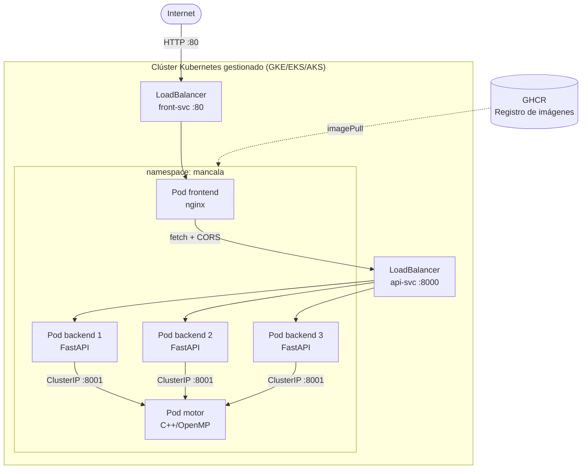

# 05 — Despliegue en la Nube con Kubernetes

Este documento explica cómo desplegar la aplicación en un clúster **Kubernetes gestionado** en la nube. Se dan instrucciones para **GKE (Google)**, **EKS (AWS)** y **AKS (Azure)**; el proceso es análogo en los tres.

---

## Prerequisitos generales

| Herramienta | Instalación |
|-------------|-------------|
| Docker | https://docs.docker.com/engine/install/ |
| kubectl | https://kubernetes.io/docs/tasks/tools/ |
| CLI del proveedor | gcloud / aws / az (ver secciones específicas) |
| Cuenta en GHCR o DockerHub | Para registrar las imágenes |

---

## Paso 1 — Publicar imágenes en un registro

Las imágenes deben estar en un registro accesible desde el clúster. Usamos **GitHub Container Registry (GHCR)**:

```bash
# Autenticarse en GHCR
echo $GITHUB_TOKEN | docker login ghcr.io -u TU_USUARIO --password-stdin

# Construir y etiquetar (usar tag inmutable, nunca latest en producción)
TAG="20260601-$(git rev-parse --short HEAD)"

docker build -t ghcr.io/TU_ORG/mancala-motor:$TAG   ./motor
docker build -t ghcr.io/TU_ORG/mancala-backend:$TAG  ./backend
docker build -t ghcr.io/TU_ORG/mancala-frontend:$TAG ./frontend

# Publicar
docker push ghcr.io/TU_ORG/mancala-motor:$TAG
docker push ghcr.io/TU_ORG/mancala-backend:$TAG
docker push ghcr.io/TU_ORG/mancala-frontend:$TAG

echo "Imágenes publicadas con tag: $TAG"
```

---

## Paso 2 — Editar manifiestos con tu org y tag

```bash
# Reemplazar YOUR_ORG y el tag en el manifiesto cloud
sed -i "s|ghcr.io/YOUR_ORG/mancala-motor:1.0.0|ghcr.io/TU_ORG/mancala-motor:$TAG|g" \
    deploy/cloud/k8s-cloud.yaml

sed -i "s|ghcr.io/YOUR_ORG/mancala-backend:1.0.0|ghcr.io/TU_ORG/mancala-backend:$TAG|g" \
    deploy/cloud/k8s-cloud.yaml

sed -i "s|ghcr.io/YOUR_ORG/mancala-frontend:1.0.0|ghcr.io/TU_ORG/mancala-frontend:$TAG|g" \
    deploy/cloud/k8s-cloud.yaml
```

---

## Opción A — GKE (Google Kubernetes Engine)

### Instalar gcloud CLI

```bash
# En Debian/Ubuntu
curl https://sdk.cloud.google.com | bash
exec -l $SHELL
gcloud init
```

### Crear clúster GKE

```bash
# Autenticarse
gcloud auth login
gcloud config set project TU_PROJECT_ID

# Crear clúster (e2-standard-4 = 4 vCPU, 16 GB RAM)
gcloud container clusters create mancala-cluster \
  --zone us-central1-a \
  --num-nodes 3 \
  --machine-type e2-standard-4 \
  --enable-autoscaling --min-nodes 1 --max-nodes 6

# Obtener credenciales para kubectl
gcloud container clusters get-credentials mancala-cluster \
  --zone us-central1-a

# Verificar conexión
kubectl cluster-info
```

### Desplegar la aplicación

```bash
kubectl apply -f deploy/cloud/k8s-cloud.yaml

# Esperar que los pods arranquen
kubectl get pods -n mancala -w

# Ver IPs externas de los LoadBalancers (puede tardar 2-3 min)
kubectl get svc -n mancala
```

### Limpiar recursos GKE

```bash
kubectl delete -f deploy/cloud/k8s-cloud.yaml
gcloud container clusters delete mancala-cluster --zone us-central1-a
```

---

## Opción B — EKS (Amazon Elastic Kubernetes Service)

### Instalar eksctl y AWS CLI

```bash
# AWS CLI
pip install awscli
aws configure   # ingresar Access Key ID, Secret, región

# eksctl
curl --silent --location \
  "https://github.com/eksctl-io/eksctl/releases/latest/download/eksctl_Linux_amd64.tar.gz" \
  | tar xz -C /tmp
sudo mv /tmp/eksctl /usr/local/bin
```

### Crear clúster EKS

```bash
eksctl create cluster \
  --name mancala-cluster \
  --region us-east-1 \
  --nodegroup-name standard-workers \
  --node-type t3.xlarge \
  --nodes 3 \
  --nodes-min 1 \
  --nodes-max 6 \
  --managed

# Actualizar kubeconfig
aws eks update-kubeconfig --name mancala-cluster --region us-east-1

kubectl cluster-info
```

### Desplegar

```bash
kubectl apply -f deploy/cloud/k8s-cloud.yaml
kubectl get pods -n mancala -w
kubectl get svc -n mancala   # esperar EXTERNAL-IP en api-svc y front-svc
```

### Limpiar EKS

```bash
kubectl delete -f deploy/cloud/k8s-cloud.yaml
eksctl delete cluster --name mancala-cluster --region us-east-1
```

---

## Opción C — AKS (Azure Kubernetes Service)

### Instalar Azure CLI

```bash
curl -sL https://aka.ms/InstallAzureCLIDeb | sudo bash
az login
```

### Crear clúster AKS

```bash
# Crear grupo de recursos
az group create --name mancala-rg --location eastus

# Crear clúster
az aks create \
  --resource-group mancala-rg \
  --name mancala-cluster \
  --node-count 3 \
  --node-vm-size Standard_D4s_v3 \
  --enable-cluster-autoscaler \
  --min-count 1 --max-count 6 \
  --generate-ssh-keys

# Obtener credenciales
az aks get-credentials --resource-group mancala-rg --name mancala-cluster

kubectl cluster-info
```

### Desplegar

```bash
kubectl apply -f deploy/cloud/k8s-cloud.yaml
kubectl get pods -n mancala -w
kubectl get svc -n mancala
```

### Limpiar AKS

```bash
kubectl delete -f deploy/cloud/k8s-cloud.yaml
az group delete --name mancala-rg --yes --no-wait
```

---

## Paso 3 — Verificar el despliegue (común a los 3 proveedores)

```bash
# Estado completo
kubectl get pods,svc,deploy -n mancala

# Salida esperada:
# NAME                           READY   STATUS    RESTARTS   AGE
# pod/backend-7d9f8b6c4-2xkpq   1/1     Running   0          5m
# pod/backend-7d9f8b6c4-8nrtv   1/1     Running   0          5m
# pod/backend-7d9f8b6c4-k9mwz   1/1     Running   0          5m
# pod/frontend-6b8c9d7f5-lp2qt  1/1     Running   0          5m
# pod/motor-5c7f9a8d2-xj4ms     1/1     Running   0          5m
#
# NAME                TYPE           CLUSTER-IP    EXTERNAL-IP    PORT(S)
# service/api-svc     LoadBalancer   10.96.0.12    34.X.X.X       8000:31000/TCP
# service/front-svc   LoadBalancer   10.96.0.15    34.Y.Y.Y       80:31080/TCP
# service/motor-svc   ClusterIP      10.96.0.20    <none>         8001/TCP

# Obtener la IP del frontend
FRONTEND_IP=$(kubectl get svc front-svc -n mancala -o jsonpath='{.status.loadBalancer.ingress[0].ip}')
echo "Frontend: http://$FRONTEND_IP"

# Obtener la IP del backend
API_IP=$(kubectl get svc api-svc -n mancala -o jsonpath='{.status.loadBalancer.ingress[0].ip}')
echo "API: http://$API_IP:8000/docs"

# Probar salud
curl http://$API_IP:8000/healthz
curl http://$API_IP:8000/readyz
```

---

## Recursos declarados (requests y limits)

Cada contenedor tiene CPU y RAM declarados explícitamente en `deploy/cloud/k8s-cloud.yaml`:

| Contenedor | CPU request | CPU limit | RAM request | RAM limit | Justificación |
|------------|:-----------:|:---------:|:-----------:|:---------:|---------------|
| motor | 1000m | 4000m | 256Mi | 512Mi | Alpha-Beta con T=4 usa hasta 4 cores |
| backend | 250m | 500m | 128Mi | 256Mi | Solo enruta HTTP, sin cómputo pesado |
| frontend | 50m | 200m | 32Mi | 64Mi | Sirve archivos estáticos |

---

## Escalado horizontal del backend

```bash
# Escalar a 5 réplicas (experimento de carga)
kubectl scale deployment backend --replicas=5 -n mancala

# Ver distribución de pods
kubectl get pods -n mancala -l app=backend

# Volver a 3 réplicas
kubectl scale deployment backend --replicas=3 -n mancala
```

---

## Diagrama del despliegue en la nube


