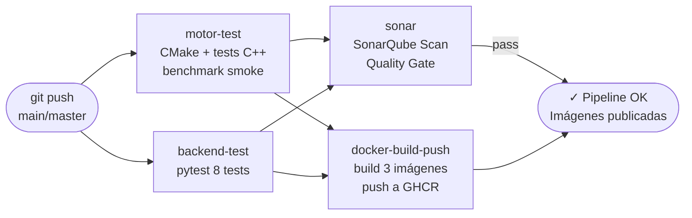

# 06 — CI/CD y Calidad de Código

## Pipeline de GitHub Actions

Archivo: `.github/workflows/ci-cd.yml`. Toda la integración está declarada en YAML versionado en el repositorio. **No se usa ningún plugin instalado desde el marketplace de GitHub.**

### Configuración inicial de Secrets

Antes de que el pipeline funcione, debes configurar los siguientes Secrets en GitHub (`Settings → Secrets and variables → Actions`):

| Secret | Descripción |
|--------|-------------|
| `GITHUB_TOKEN` | Automático — GitHub lo inyecta; permite push a GHCR |
| `SONAR_TOKEN` | Token de SonarQube/SonarCloud (`User → Security → Generate Token`) |
| `SONAR_HOST_URL` | URL de tu instancia (`https://sonarcloud.io` o tu servidor) |

### Diagrama del pipeline



### Jobs del pipeline

| Job | Trigger | Qué hace |
|-----|---------|----------|
| `motor-test` | push/PR | CMake Release, `mancala_tests`, smoke benchmark |
| `backend-test` | push/PR | `pytest backend/tests/` — 8 tests |
| `sonar` | push a main | Análisis estático SonarQube, Quality Gate |
| `docker-build-push` | push a main | Build y push de 3 imágenes a GHCR con tag inmutable |

### Integración SonarQube (declarada en YAML, no plugin)

```yaml
- name: SonarQube Scan
  uses: sonarsource/sonarqube-scan-action@v2
  env:
    SONAR_TOKEN: ${{ secrets.SONAR_TOKEN }}
    SONAR_HOST_URL: ${{ secrets.SONAR_HOST_URL }}
  with:
    args: >
      -Dsonar.projectKey=mancala-kalah
      -Dsonar.sources=motor/src,backend/app,frontend/html
      -Dsonar.tests=motor/tests,backend/tests
      -Dsonar.cplusplus.file.suffixes=.cpp,.hpp
      -Dsonar.python.version=3.12
```

### Tags de imagen inmutables

```yaml
- name: Set image tag
  id: tag
  run: echo "TAG=$(date +%Y%m%d)-${GITHUB_SHA::7}" >> $GITHUB_OUTPUT
# Genera: 20260601-abc1234
```

En los manifiestos de producción (`deploy/cloud/k8s-cloud.yaml`) se usa ese tag, nunca `latest`.

## Pruebas Automatizadas

### C++ (job `motor-test`)

```bash
cmake -S motor -B motor/build -DCMAKE_BUILD_TYPE=Release
cmake --build motor/build --parallel
./motor/build/mancala_tests       # 12 tests
OMP_NUM_THREADS=2 ./motor/build/mancala_bench --algo alphabeta --depth 6
```

### Python (job `backend-test`)

```bash
python -m pytest backend/tests/ -v --tb=short   # 8 tests
```

## Quality Gate de SonarQube

Configurar en SonarQube/SonarCloud:

- Cobertura de código (nuevas líneas) ≥ 70%
- Duplicaciones ≤ 3%
- Bugs nuevos = 0
- Vulnerabilidades nuevas = 0
- Code smells nuevos ≤ 5

Si el Quality Gate falla, el job `sonar` devuelve exit code ≠ 0 y el pipeline se marca como fallido.
